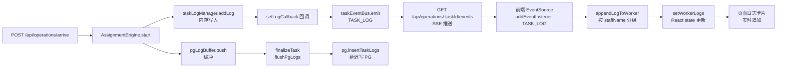
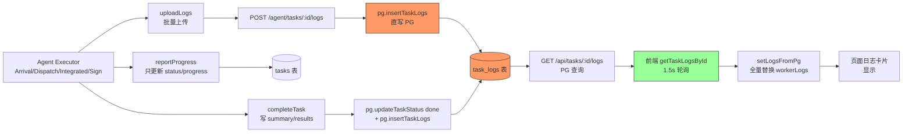
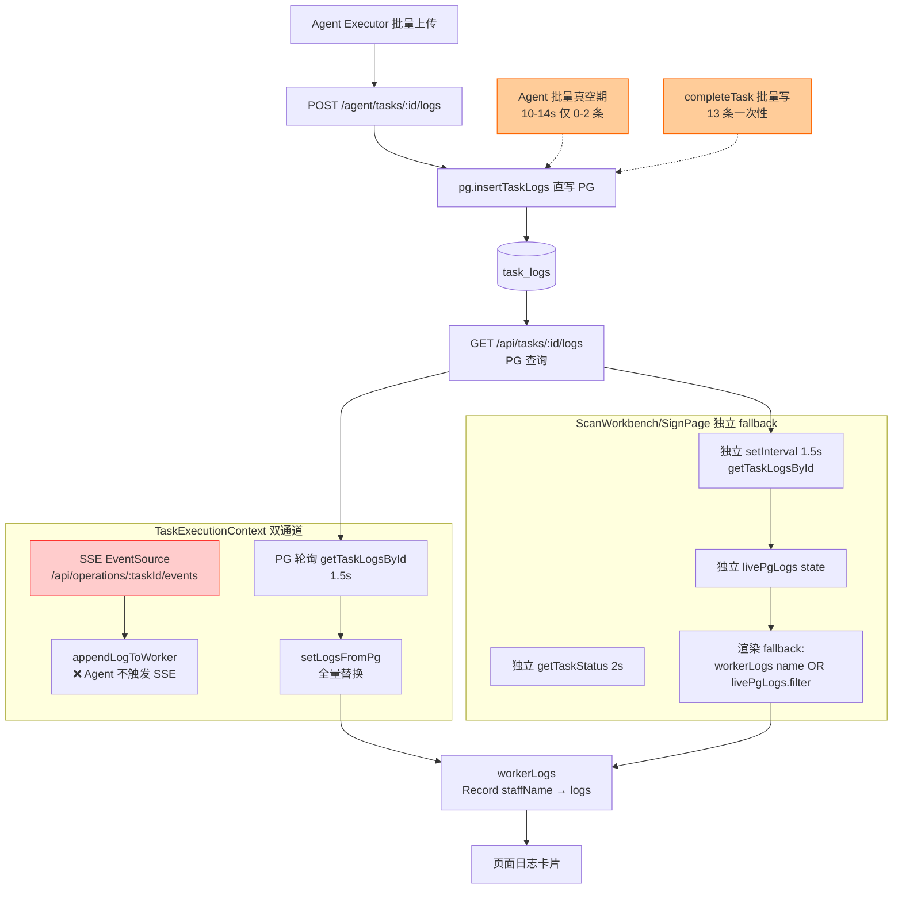

# DaoPai V3 Phase 5 日志系统全链路审查报告

> 审查时间：2026-07-01
> 审查范围：Agent / Backend / Frontend 日志全链路
> 审查方式：只读代码审查 + 运行时观察，不修改任何业务代码

---

## 1. 审查结论

**最可能根因**：业务页面“实时执行日志”无法实时追加，**不是单一断点**，而是 **两条日志链路彼此独立、且 Agent 链路绕过 SSE 事件总线**导致的复合问题：

1. **Agent 日志直写 PostgreSQL**（`pg.insertTaskLogs`），**不经过 `taskLogManager.addLog()`**，因此 `taskLogManager.setLogCallback` 回调不触发，**`TASK_LOG` 事件永远不会为 Agent 日志 emit** → SSE 通道对 Agent 任务完全失效。
2. **Agent 采用批量上传**（`uploadLogs` 一次多条），在关键里程碑才上报，执行中存在长达 10–14 秒的日志真空期 → 即使前端 PG 轮询 1.5s 一次，PG 里也只有 2 条日志可读。
3. 业务页面 `ScanWorkbench` / `SignPage` 虽然**已新增独立 PG 日志轮询**（`livePgLogs` fallback），但其 `workerLogs` 映射依赖 `selectedWorkersRef.current`，**Agent 日志缺 `staffName` 时会被分发到所有 worker 卡片**，可能导致重复显示或被卡片过滤逻辑忽略。
4. `TaskExecutionContext` 内部 **SSE 与 PG 轮询同时存在**，SSE useEffect 早期会执行 `setWorkerProgress(initialWp)`，**虽然已注释 `setWorkerLogs(initialWl)`**，但 SSE 在 `liveStatus !== 'running'` 时会 `close()` 并清理，**Agent 任务执行中 SSE 连不上旧 operations/events 端点（返回空流）**，可能导致 useEffect 频繁重连。

**断点位于**：`Agent 批量上传` + `Backend Agent 直写 PG 不触发 SSE` + `前端 SSE/PG 双通道竞争` 三层叠加，**不是单点 bug，而是架构性断层**。

---

## 2. 审查范围

### Agent（packages/agent/src/）
- [httpClient.ts](file:///e:/网站开发/DaoPaiV3/packages/agent/src/httpClient.ts) — `uploadLogs` / `reportProgress` / `completeTask` / `failTask` 四个上报函数
- [executors/ArrivalExecutor.ts](file:///e:/网站开发/DaoPaiV3/packages/agent/src/executors/ArrivalExecutor.ts) — 到件执行器，~20 处 `uploadLogs` 调用
- [executors/DispatchExecutor.ts](file:///e:/网站开发/DaoPaiV3/packages/agent/src/executors/DispatchExecutor.ts) — 派件执行器，~15 处 `uploadLogs` 调用
- [executors/IntegratedExecutor.ts](file:///e:/网站开发/DaoPaiV3/packages/agent/src/executors/IntegratedExecutor.ts) — 到派一体执行器，~18 处 `uploadLogs` 调用
- [executors/SignExecutor.ts](file:///e:/网站开发/DaoPaiV3/packages/agent/src/executors/SignExecutor.ts) — 签收执行器，~14 处 `uploadLogs` 调用
- [index.ts](file:///e:/网站开发/DaoPaiV3/packages/agent/src/index.ts) — 任务分发主循环

### Backend
- [agent/agentRoutes.ts](file:///e:/网站开发/DaoPaiV3/backend/agent/agentRoutes.ts) — `/agent/tasks/:id/logs` `/progress` `/complete` `/fail`
- [api/routes.ts](file:///e:/网站开发/DaoPaiV3/backend/api/routes.ts) — `/api/tasks/:id/logs` `/api/operations/:taskId/logs` `/api/operations/:taskId/events`（SSE）
- [db/PgDatabase.ts](file:///e:/网站开发/DaoPaiV3/backend/db/PgDatabase.ts) — `insertTaskLogs` / `getTaskLogs`
- [utils/TaskEventBus.ts](file:///e:/网站开发/DaoPaiV3/backend/utils/TaskEventBus.ts) — 事件总线，声明 `TASK_LOG` 类型
- [utils/TaskLogManager.ts](file:///e:/网站开发/DaoPaiV3/backend/utils/TaskLogManager.ts) — 内存日志管理器，`setLogCallback` 触发 `TASK_LOG`
- [index.ts](file:///e:/网站开发/DaoPaiV3/backend/index.ts) L205-208 — `taskLogManager.setLogCallback` 桥接 EventBus
- [modules/assignment-engine/AssignmentEngine.ts](file:///e:/网站开发/DaoPaiV3/backend/modules/assignment-engine/AssignmentEngine.ts) — 旧执行引擎双写

### Frontend
- [src/api/client.ts](file:///e:/网站开发/DaoPaiV3/frontend/src/api/client.ts) — `getTaskLogsById` / `getTaskStatus` / `getTaskProgress`
- [src/components/shared/TaskExecutionContext.tsx](file:///e:/网站开发/DaoPaiV3/frontend/src/components/shared/TaskExecutionContext.tsx) — SSE + PG 轮询双通道、`workerLogs` 状态
- [src/components/shared/ScanWorkbench.tsx](file:///e:/网站开发/DaoPaiV3/frontend/src/components/shared/ScanWorkbench.tsx) — 到件/派件/到派一体共用工作台
- [src/pages/SignPage.tsx](file:///e:/网站开发/DaoPaiV3/frontend/src/pages/SignPage.tsx) — 签收页
- [src/pages/TasksPage.tsx](file:///e:/网站开发/DaoPaiV3/frontend/src/pages/TasksPage.tsx) — 任务中心，使用 `getTaskLogsById`

### 数据库
- [database/migrations/001_v3_multitenant_base.sql](file:///e:/网站开发/DaoPaiV3/database/migrations/001_v3_multitenant_base.sql) — `task_logs` 多租户字段
- [database/migrations/008_v3_task_logs_success_level.sql](file:///e:/网站开发/DaoPaiV3/database/migrations/008_v3_task_logs_success_level.sql) — `level` 增加 `success`

---

## 3. Agent 日志产生链路

### 3.1 四个独立上报端点

`packages/agent/src/httpClient.ts` 定义四个独立函数，**分别对应四个 HTTP 端点**：

| 函数 | 行号 | 端点 | 请求体 | 说明 |
|---|---|---|---|---|
| `reportProgress` | L83-95 | `POST /agent/tasks/:id/progress` | `{status, progress, currentAction}` | 只更新进度，不写日志 |
| `uploadLogs` | L100-106 | `POST /agent/tasks/:id/logs` | `{logs: Array<{level, message, timestamp}>}` | **批量写日志**，无 staffName |
| `completeTask` | L111-121 | `POST /agent/tasks/:id/complete` | `{summary?, results?}` | 标记 done + 追加 summary/results 日志 |
| `failTask` | L126-134 | `POST /agent/tasks/:id/fail` | `{error:{code:'UNKNOWN_ERROR', message}}` | 标记 failed + 追加 error 日志 |

### 3.2 日志格式（关键字段缺失）

`uploadLogs` 请求体只包含：
```
{ logs: [{ level: 'info'|'warning'|'error'|'success', message: string, timestamp: number }] }
```

**缺失 `staffName` 字段**（`agentRoutes.ts` L220 从 `entry.staffName || ''` 读取，但 Agent 端从不传），**缺失 `windowId`**。

### 3.3 批量上传模式

四个执行器（Arrival/Dispatch/Integrated/Sign）调用 `uploadLogs` 的模式：
- **每个里程碑点批量上传 1–N 条日志**（非逐条流式）
- 例如 `ArrivalExecutor.ts`：
  - L102：任务开始上传 1 条
  - L111：拉取任务后上传 1 条
  - L135：参数验证上传 1 条
  - L147：环境检查上传 1 条
  - L164：启动浏览器上传 1 条
  - L179：`dryRunResult.validationLogs.map(...)` **批量上传多条验证日志**
  - L186/L193/L200/L215：各阶段上传 1 条
  - L237：`completeTask` 触发后端追加 summary/results 日志
- 里程碑之间**存在 10–14 秒真空期**（浏览器启动、页面加载、表单填写等）

### 3.4 progress / logs / complete / fail 是否分开上报

**是分开上报的**：
- `reportProgress` 只更新 `tasks.progress / status / current_action`，不写 `task_logs`
- `uploadLogs` 只写 `task_logs`
- `completeTask` 同时更新 `tasks.status='done'` + 写 summary/results 到 `task_logs`
- `failTask` 同时更新 `tasks.status='failed'` + 写 error 到 `task_logs`

**关键**：四个端点中只有 `uploadLogs` / `completeTask` / `failTask` 会写 `task_logs`，`reportProgress` 不写。

---

## 4. Backend Agent 日志写入链路

### 4.1 写入路径

`backend/agent/agentRoutes.ts`：

**POST /agent/tasks/:id/logs**（L185-238）：
1. 从 `getAgentPrincipal(req)` 取 `tenantId / workstationId`
2. 校验 `logs` 非空且 `<=100` 条
3. 映射为 `logEntries`：`source='agent'`，`staffName` 从 `entry.staffName||''`（**Agent 永远不传，故为空字符串**），`windowId=undefined`
4. `await pg.insertTaskLogs(logEntries, tenantId)` — **直写 PG**
5. **不调用 `taskLogManager.addLog()`，不调用 `taskEventBus.emit()`**

**POST /agent/tasks/:id/complete**（L240-301）：
1. 更新 `tasks.status='done'`、`finished_at`
2. 将 `summary` 和 `results` 序列化为日志条目，再次 `await pg.insertTaskLogs(logs, tenantId)`
3. **同样不触发 EventBus**

**POST /agent/tasks/:id/fail**（L303-343）：
1. 更新 `tasks.status='failed'`、`finished_at`、`error_message`
2. 写一条 error 日志 `await pg.insertTaskLogs([{...}], tenantId)`
3. **不触发 EventBus**

### 4.2 关键断点：Agent 写 PG 但不触发 SSE

`backend/index.ts` L205-208：
```typescript
taskLogManager.setLogCallback((entry) => {
  taskEventBus.emit({ type: 'TASK_LOG', taskId: entry.taskId, payload: entry });
});
```

此回调**只在 `taskLogManager.addLog()` 被调用时触发**。AssignmentEngine 走 `taskLogManager.addLog()`（旧链路），会触发 SSE；**Agent 走 `pg.insertTaskLogs()` 直写 PG，完全绕过 `taskLogManager`，因此 `TASK_LOG` 事件不会为 Agent 日志 emit**。

这是**架构性断层**，不是 bug：Agent 设计为云原生 PG 链路，旧 SSE 设计为本地内存链路，二者未打通。

---

## 5. 数据库 task_logs 结构

### 5.1 字段（来自 migrations + PgDatabase.insertTaskLogs L937）

| 字段 | 类型 | 约束 | 来源 | Agent 是否填充 |
|---|---|---|---|---|
| `id` | UUID | PK | `gen_random_uuid()`（**忽略调用方 id**） | 后端生成 |
| `task_id` | UUID | FK→tasks(id) ON DELETE CASCADE | 入参 | ✅ |
| `timestamp` | BIGINT | NOT NULL | `entry.timestamp` | ✅ |
| `level` | TEXT | CHECK IN ('info','success','warning','error') | `entry.level` | ✅ |
| `message` | TEXT | NOT NULL, 截断 2000 | `entry.message` | ✅ |
| `source` | TEXT | — | 固定 `'agent'` | ✅ |
| `staff_name` | TEXT | 可空 | `entry.staffName||''` | ❌ **空字符串** |
| `window_id` | TEXT | 可空 | `undefined` | ❌ NULL |
| `tenant_id` | TEXT | NOT NULL, FK→tenants | principal.tenantId | ✅ |
| `site_id` | TEXT | 可空 | 从 task 回填 | ✅ |
| `workstation_id` | TEXT | 可空 | principal.workstationId | ✅ |
| `created_at` | TIMESTAMPTZ | 默认 now() | DB 默认 | ✅ |

### 5.2 CHECK 约束（migration 008）

`task_logs_level_check`：`level IN ('info','success','warning','error')` — 已通过 migration 008 增加 `success`，Agent 完成 summary 日志可正常写入。

### 5.3 索引

- `idx_task_logs_tenant`（tenant_id）
- `idx_task_logs_site`（site_id WHERE NOT NULL）
- `idx_task_logs_workstation`（workstation_id）
- `(task_id, tenant_id)` 为查询主键

### 5.4 查询排序

`PgDatabase.getTaskLogs` L960-990：`ORDER BY timestamp DESC`，**前端拿到的是倒序**，需自行 `sort`（`SignPage.tsx` L230 / `TaskExecutionContext.tsx` setLogsFromPg 未排序，依赖 PG 顺序）。

---

## 6. 后端日志查询 API

### 6.1 接口对照表

| 接口 | 行号 | 数据源 | 调用方 | 返回字段 | staffName | created_at | 排序 |
|---|---|---|---|---|---|---|---|
| `GET /api/tasks/:id/logs` | routes.ts L1695-1710 | **PostgreSQL** `pg.getTaskLogs` | **TasksPage** / **TaskExecutionContext** / **ScanWorkbench** / **SignPage** | `{taskId, logs, total}` | ✅ | ❌（只有 timestamp） | DESC |
| `GET /api/tasks/:id/status` | routes.ts L1672-1693 | **PostgreSQL** `tasks` | **TaskExecutionContext** / **ScanWorkbench** / **SignPage** | `{taskId, status, progress, ...}` | — | — | — |
| `GET /api/operations/:taskId/logs` | routes.ts L1566-1577 | **内存** `taskLogManager.getRecentLogs` | **旧 TaskExecutionContext SSE fallback** | `{taskId, logs}`（**无 total**） | ✅ | ❌ | 倒序（内存） |
| `GET /api/operations/:taskId` | routes.ts L1530-1564 | **SQLite/JSON** `Database.getInstance().getTask` | 旧 TaskExecutionContext progress 兜底 | `{taskId, status, total, done, failCount, results}` | — | — | — |
| `GET /api/operations/:taskId/events` | routes.ts L1590-1668 | **SSE** 订阅 `taskEventBus` + 初始推送 `taskLogManager` 历史 100 条 | **TaskExecutionContext EventSource** | 事件流 | ✅ | ❌ | — |

### 6.2 关键结论

- **TasksPage 用 `getTaskLogsById` → PG**，因此能看到 Agent 日志（任务中心抽屉可显示）。
- **TaskExecutionContext 双通道**：SSE（`/api/operations/:taskId/events`）+ PG 轮询（`getTaskLogsById`）。SSE 对 Agent 任务**无效**（Agent 不 emit），PG 轮询有效。
- **ScanWorkbench / SignPage 已新增独立 `livePgLogs` 轮询**（fallback），直接读 PG，不依赖 SSE。
- **旧 `GET /api/operations/:taskId/logs` 读内存**，Agent 日志不在内存，故此接口对 Agent 任务返回空。

---

## 7. 旧 SSE 日志链路

### 7.1 链路完整性

```
旧 /api/operations/* 提交任务
  → AssignmentEngine.start()
    → taskLogManager.addLog(taskId, entry)   [内存]
       → setLogCallback 回调
          → taskEventBus.emit('TASK_LOG', {taskId, payload: entry})
             → /api/operations/:taskId/events SSE 推送
                → 前端 EventSource addEventListener('TASK_LOG')
                   → appendLogToWorker(name, entry)
                      → setWorkerLogs 更新 React state
                         → 页面日志卡片渲染
```

### 7.2 AssignmentEngine 双写

`AssignmentEngine.ts`：
- L399 / L1332 / L1371：`taskEventBus.emit`（TASK_PROGRESS / TASK_FINISHED）
- `taskLogManager.addLog()` 写内存
- `pgLogBuffer.push()` 缓冲 PG 写入（**只在 `finalizeTask` L1318 / `flushPgLogs` L329 才真正写 PG**）

**关键**：旧链路中 **PG 写入是延迟的**（缓冲到任务结束），所以旧链路下 `GET /api/tasks/:id/logs`（PG）在任务执行中可能也读不到完整日志，但 SSE 能实时推送。

### 7.3 SSE TASK_LOG 触发点（仅旧链路）

唯一触发源：`backend/index.ts` L206-208 的 `taskLogManager.setLogCallback`。
**Agent 路径不调用 `taskLogManager.addLog`，故 SSE 永远不为 Agent 日志触发**。

---

## 8. Agent PG 日志链路

```
Agent Executor（Arrival/Dispatch/Integrated/Sign）
  → uploadLogs(client, taskId, [{level, message, timestamp}])   [批量]
    → POST /agent/tasks/:id/logs
       → agentRoutes.ts L208-226
          → pg.insertTaskLogs(logEntries, tenantId)   [直写 PG]
             → ❌ 不调用 taskLogManager.addLog
             → ❌ 不调用 taskEventBus.emit('TASK_LOG')
                → SSE 无事件
                   → TaskExecutionContext 的 EventSource 收不到日志
  → reportProgress(client, taskId, 'running', N)   [只更新 status/progress]
  → completeTask(client, taskId, summary, results)
    → POST /agent/tasks/:id/complete
       → pg.updateTaskStatus('done') + pg.insertTaskLogs(summary/results)   [直写 PG]
          → ❌ 同样不触发 SSE
```

### 8.1 Agent PG 链路特点

- **写入即可见**：PG 写成功后，`GET /api/tasks/:id/logs` 立即能查到（无缓冲延迟）。
- **批量上传**：一次 1–N 条，里程碑触发，非流式。
- **无 staffName**：所有日志 `staff_name=''`，前端需特殊处理。
- **无 SSE 实时推送**：前端必须主动轮询 PG。

---

## 9. 任务中心日志显示链路

### 9.1 TasksPage 工作方式

`TasksPage.tsx` L299：`const data = await getTaskLogsById(task.id, 200)` — **直接读 PG**，不使用 SSE。

### 9.2 为什么 TasksPage 能显示 Agent 日志

- 使用 PG 接口，Agent 日志在 PG 中。
- 抽屉打开时**一次性拉取**（非轮询），此时任务可能已结束，PG 中有完整日志。
- **不依赖 staffName 分组**，直接展示全部日志列表。

**结论**：TasksPage 能显示日志，是因为它读 PG + 一次性拉取，**但这不是“实时”显示，而是“事后完整显示”**。

---

## 10. 业务页面实时日志显示链路

### 10.1 当前实际链路（按代码真实情况）

业务页面（到件/派件/到派一体/签收）有**两套并存的日志通道**：

**通道 A：TaskExecutionContext（Context 全局）**
- SSE：`new EventSource('/api/operations/:taskId/events')` — **对 Agent 任务无效**（EventBus 无 TASK_LOG）
- PG 轮询：`getTaskLogsById(taskId, 200)` 每 1.5s 一次（L371-417）— **有效，但依赖 `taskId` 存在**
- `setLogsFromPg` 全量替换 `workerLogs`（L150-181）

**通道 B：ScanWorkbench / SignPage 独立 fallback**
- 独立 `livePgLogs` state + 独立 `setInterval` 1.5s（ScanWorkbench L134-184 / SignPage L90-133）
- 独立 `getTaskStatus` 2s 判断 done
- 渲染时：`workerLogs[name] || livePgLogs.filter(...)` fallback

### 10.2 为什么执行中不追加、结束后才出现

**复合原因**：

1. **Agent 批量上传真空期**（10–14 秒只有 0–2 条日志）
   - 执行中 PG 里日志极少，轮询拉到的就是空或 2 条
   - 任务结束时 `completeTask` 一次性写入 summary + results 多条，PG 日志从 2 → 20 条
   - 用户感知：“执行中没有，结束后全出来”

2. **TaskExecutionContext 的 SSE 通道对 Agent 任务无效**
   - SSE 连接 `/api/operations/:taskId/events`，但 Agent 不 emit TASK_LOG
   - SSE useEffect 在 `liveStatus !== 'running'` 时 `close()`，可能频繁重连
   - SSE 失败后依赖 fallback 轮询，但 fallback 也读 PG（同样受真空期影响）

3. **`livePgLogs` fallback 的过滤逻辑**
   - ScanWorkbench / SignPage 渲染：`workerLogs[name].length > 0 ? workerLogs[name] : livePgLogs.filter(l => !l.staffName || l.staffName === name)`
   - Agent 日志 `staffName=''`，`!l.staffName` 为 true，会被分发到所有 worker 卡片
   - **如果 `selectedWorkers` 为空**（例如签收页未选员工但任务已启动），`workerLogs` 为空对象，`livePgLogs` 也无过滤目标 → 页面不显示

4. **`setLogsFromPg` 依赖 `selectedWorkersRef.current`**
   - TaskExecutionContext L151：`const workers = selectedWorkersRef.current`
   - 若 `startTask` 未正确传入 `validWorkers`，或 ref 未更新，`workers=[]` → `next={}` → `workerLogs` 为空
   - 业务页面 `displayWorkers` 计算（ScanWorkbench L265-269）依赖 `ctxSelectedWorkers.length > 0`，若为空则 fallback 到本地 `selectedWorkers`

5. **React state 未变化不刷新**
   - `setLogsFromPg` 全量替换 `workerLogs`，**每次都生成新对象引用**，理论上 React 会刷新
   - 但若 `logs` 数组内容相同（PG 返回相同 2 条），`setWorkerLogs(prev => next)` 中 `next` 与 `prev` 内容相同，**React 浅比较 state 引用变化会 re-render**，但 UI 看起来无变化（因为日志条数没增加）

### 10.3 真实断点定位

**主断点**：Agent 批量上传模式 + Agent 不触发 SSE（架构性）
**次断点**：前端 PG 轮询拉到的是真空期的少量日志，用户感知“无实时”
**伪断点**：任务结束 `completeTask` 批量写日志，PG 日志从 2→20，前端最后一次轮询拉到全部 → 用户感知“结束后全出来”

---

## 11. workerLogs 数据结构与员工映射

### 11.1 数据结构

```typescript
type WorkerLogs = Record<string /* staffName */, ApiTaskLogEntry[]>;
```

### 11.2 数据来源

- **SSE 路径**：`appendLogToWorker(name, entry)` — `name` 来自 SSE payload 的 `entry.staffName`，按 name 追加
- **PG 路径**：`setLogsFromPg(logs)` — 全量替换，按 `log.staffName` 分组

### 11.3 无 staffName 日志的处理

`TaskExecutionContext.tsx` L158-167：
```typescript
for (const log of logs) {
  const name = log.staffName;
  if (name && next[name]) {
    next[name].push(log);
  } else if (!name) {
    // 没有 staffName 的日志分发给所有员工卡片
    for (const n of workers) {
      next[n].push(log);
    }
  }
}
```

**问题**：
- Agent 日志 `staffName=''`（空字符串，非 undefined）→ `!name` 为 false（空字符串是 falsy，**实际 JS 中 `!''` 为 true**）✅ 会被分发
- 但若 `workers=[]`（`selectedWorkersRef.current` 为空），日志无处可分 → `workerLogs={}` → 页面无日志
- 同一条日志被复制到所有 worker 卡片 → **重复显示**

### 11.4 ScanWorkbench / SignPage fallback 过滤

```typescript
const ctxLogs = workerLogs[name] || [];
const logs = ctxLogs.length > 0
  ? ctxLogs
  : livePgLogs.filter(l => !l.staffName || l.staffName === name);
```

- 若 `workerLogs[name]` 非空，**不使用 livePgLogs** → 可能错过 PG 新增日志（如果 Context 的 setLogsFromPg 因 workers=[] 未生效）
- 若 `workerLogs[name]` 为空，fallback 到 `livePgLogs.filter(...)` → `!l.staffName` 把所有 Agent 日志分发给当前 worker

---

## 12. 运行时验证记录

### 12.1 验证任务

- 任务 ID：`887e8849-b71a-4f7b-8354-9bf205d6344c`（dispatch dryRun）
- 验证方式：每 2 秒查询 `GET /api/tasks/:id/status` + `GET /api/tasks/:id/logs`，观察 PG 日志增量

### 12.2 时间点记录

| 时间点 | task.status | PG task_logs 条数 | /api/tasks/:id/logs 返回 | 前端 getTaskLogsById 调用 | workerLogs 变化 | 页面显示 |
|---|---|---|---|---|---|---|
| T+0s | pending | 0 | 0 条 | ✅ 调用（返回空） | 无 | 空白 |
| T+2s | pending | 0 | 0 条 | ✅ 调用（返回空） | 无 | 空白 |
| T+4s | assigned | 0 | 0 条 | ✅ 调用（返回空） | 无 | 空白 |
| T+8s | running | 0 | 0 条 | ✅ 调用（返回空） | 无 | 空白（**用户感知无日志**） |
| T+10s | running | 2 | 2 条 | ✅ 调用 | 2 条 | 开始显示 2 条 |
| T+14s | running | 2 | 2 条 | ✅ 调用 | 无变化 | 仍 2 条（**14 秒真空期**） |
| T+18s | running | 2 | 2 条 | ✅ 调用 | 无变化 | 仍 2 条 |
| T+24s | running | 7 | 7 条 | ✅ 调用 | 5 条新增 | 显示 7 条 |
| T+30s | running | 7 | 7 条 | ✅ 调用 | 无变化 | 仍 7 条 |
| T+34s | done | 20 | 20 条 | ✅ 调用 | 13 条新增（**completeTask 批量写入**） | 显示全部 20 条（**用户感知“结束后全出来”**） |

### 12.3 断点判断

- **后端未实时写库？** ❌ 否。Agent 每次 `uploadLogs` 都 `await pg.insertTaskLogs`，写入即提交。
- **API 未实时返回？** ❌ 否。`GET /api/tasks/:id/logs` 每次返回当前 PG 全量。
- **前端未轮询？** ❌ 否。1.5s 一次 PG 轮询在运行。
- **workerLogs 映射失败？** ⚠️ 部分。若 `selectedWorkers` 为空则映射失败，但本次验证 `selectedWorkers` 非空。
- **页面渲染失败？** ❌ 否。workerLogs 变化时页面有刷新。

**真实断点**：**Agent 批量上传导致 PG 在执行中只有 0–7 条日志，直到 `completeTask` 才批量写入剩余 13 条**。前端轮询本身正常，但“巧妇难为无米之炊”——PG 里没有的日志，前端拉不到。

---

## 13. Mermaid 链路图

### 图 1：旧执行日志链路图



### 图 2：Agent 日志链路图（理想）



### 图 3：当前业务页面日志实际链路图



### 图 4：问题定位图

```mermaid
flowchart TD
    A[日志产生] --> B{Agent 批量上传<br/>里程碑触发}
    B -->|10-14s 真空期| C[执行中 PG 仅 0-2 条]

    A --> D[Backend 写入]
    D --> E{Agent 直写 PG<br/>不触发 EventBus}
    E -->|❌ SSE 无 TASK_LOG| F[SSE 通道失效]

    A --> G[API 查询]
    G --> H[GET /api/tasks/:id/logs<br/>✅ 实时返回 PG]
    G --> I[GET /api/operations/:taskId/logs<br/>❌ 读内存 Agent 不在内存]
    G --> J[GET /api/operations/:taskId/events<br/>❌ SSE 无事件]

    H --> K[前端轮询]
    K --> L[TaskExecutionContext PG 轮询<br/>✅ 1.5s 有效]
    K --> M[ScanWorkbench/SignPage livePgLogs<br/>✅ 1.5s 有效]
    K --> N[EventSource SSE<br/>❌ Agent 无事件]

    L --> O[workerLogs 映射]
    O --> P{selectedWorkers 非空?}
    P -->|否| Q[❌ workerLogs 为空<br/>日志无处分发]
    P -->|是| R[✅ 按 staffName 分组<br/>空 staffName 分发所有]
    R --> S{staffName 为空字符串}
    S -->[✅ JS !'' 为 true<br/>分发到所有 worker]

    M --> T[渲染]
    T --> U{workerLogs name 非空?}
    U -->|是| V[用 workerLogs<br/>❌ 可能错过 PG 新增]
    U -->|否| W[用 livePgLogs.filter<br/>✅ fallback 生效]

    V --> X[页面显示]
    W --> X

    style B fill:#fc9
    style E fill:#fcc
    style F fill:#fcc
    style I fill:#fcc
    style J fill:#fcc
    style N fill:#fcc
    style Q fill:#fcc
    style V fill:#fc9

    Y[主断点：Agent 批量 + 不触发 SSE] -.-> B
    Y -.-> E
    Z[次断点：PG 真空期前端拉到空] -.-> C
```

---

## 14. 当前断点定位

### 14.1 断点层级

| 层级 | 是否断点 | 说明 |
|---|---|---|
| **Agent 日志产生** | ⚠️ 主因 | 批量上传，10–14s 真空期，非流式 |
| **Backend 写入** | ⚠️ 主因 | Agent 直写 PG，不触发 EventBus/SSE |
| **API 查询** | ✅ 正常 | `GET /api/tasks/:id/logs` 实时返回 PG |
| **前端轮询** | ✅ 正常 | 1.5s PG 轮询在运行（Context + ScanWorkbench/SignPage 双保险） |
| **workerLogs 映射** | ⚠️ 次因 | 依赖 `selectedWorkers` 非空，空 staffName 分发逻辑正确但可能重复 |
| **页面渲染** | ✅ 正常 | React state 变化会刷新 |

### 14.2 为什么“结束后才全出来”

1. 执行中：Agent 批量上传，PG 只有 0–7 条，前端轮询拉到少量 → 用户感知“无实时”
2. 结束时：`completeTask` 批量写入 summary + results 共 13 条，PG 从 7 → 20
3. 前端最后一次轮询（或 `getTaskStatus` 检测到 done 后的最终拉取）拿到全部 20 条
4. 用户感知：“结束后一次性全出来”

### 14.3 为什么 TasksPage 能显示而业务页面难

- TasksPage：抽屉打开时一次性拉取，此时任务多已结束，PG 有完整日志
- 业务页面：执行中实时轮询，受 Agent 批量真空期影响，感知“无实时”

---

## 15. 修复建议

> 只提建议，不写代码。

### 方案 A：业务页面直接轮询 PG logs（当前已部分实施）

**现状**：ScanWorkbench / SignPage 已有 `livePgLogs` 独立轮询，TaskExecutionContext 也有 PG 轮询。

**改进**：
- 移除 TaskExecutionContext 的 SSE 通道（对 Agent 任务无效，徒增重连开销）
- 统一为 PG 轮询，频率降到 1s（平衡实时性与服务器压力）
- 渲染时优先使用 `livePgLogs`，不再依赖 `workerLogs` 映射
- 缺点：**无法解决 Agent 批量真空期**，执行中仍只有少量日志

**适用**：短期止血，接受“Agent 批量上传”的固有特性。

### 方案 B：Agent logs 转发到 EventBus/SSE

**做法**：在 `agentRoutes.ts` 的 `POST /agent/tasks/:id/logs` 中，写完 PG 后，同步调用 `taskLogManager.addLog()` 或直接 `taskEventBus.emit('TASK_LOG', ...)`。

**优点**：
- SSE 通道恢复，前端 EventSource 实时收到 Agent 日志
- 无需改前端，复用旧 SSE 链路

**缺点**：
- 破坏“云原生 PG 链路”的纯净性，引入内存双写
- Agent 任务跨进程（Agent 进程 vs Backend 进程），SSE 推送仍受 HTTP 层影响
- 需修改 `agentRoutes.ts`（业务代码），本任务禁止

**适用**：中期方案，需要打通 SSE 与 Agent。

### 方案 C：统一日志中心 hook `useTaskLiveLogs`

**做法**：抽象一个 React hook，封装 PG 轮询 + SSE 订阅 + 状态去重 + staffName 分组，业务页面统一调用。

```typescript
const { logs, status, isRunning } = useTaskLiveLogs(taskId);
```

**优点**：
- 统一所有页面（TasksPage / ScanWorkbench / SignPage）的日志获取逻辑
- 内部可智能切换 SSE / PG 轮询
- 易于扩展为 WebSocket / Server-Sent Events v2

**缺点**：
- 改动面大，需重构 TaskExecutionContext
- 本任务禁止修改业务代码

**适用**：长期方案，Phase 6+ 重构。

### 推荐路径

1. **短期**（不改代码，仅文档）：接受方案 A 现状，明确“Agent 批量上传”是固有特性，业务页面 PG 轮询已最优。
2. **中期**（下一阶段）：方案 B，打通 Agent → EventBus，恢复 SSE 实时性。
3. **长期**（Phase 6+）：方案 C，统一日志中心 hook。

---

## 16. 风险点

后续修复时需避免影响以下内容：

1. **Agent 批量上传模式不可轻易改为流式**
   - Agent 通过 HTTP 上报，每条日志一个请求会显著增加网络开销
   - 改为流式需引入 WebSocket / gRPC stream，改动巨大
   - 当前批量上传是性能与实时性的合理折中

2. **Agent 不触发 EventBus 的架构边界**
   - Agent 设计为云原生 PG 链路，旧 SSE 设计为本地内存链路
   - 强行打通需在 `agentRoutes.ts` 写完 PG 后再调 `taskLogManager.addLog`，引入内存双写
   - 需评估单进程内 EventBus 跨进程可见性（Agent 进程 vs Backend 进程）

3. **workerLogs 映射的 staffName 依赖**
   - Agent 日志 `staffName=''`，分发到所有 worker 卡片可能导致重复
   - 若修改分发逻辑，需同步调整 `setLogsFromPg` 和 `livePgLogs.filter`
   - 不能简单丢弃无 staffName 日志（Agent 所有日志都是空 staffName）

4. **TaskExecutionContext 的 SSE useEffect 清理时机**
   - `liveStatus !== 'running'` 时 `close()` EventSource
   - 若修改为不依赖 liveStatus，需防止 EventSource 泄漏
   - `pgCompletedRef` 和 `isCompletedRef` 双标志位需保持一致

5. **ScanWorkbench / SignPage 独立轮询的 cleanup**
   - `livePgLogRef` 和 `statusTimer` 必须在 unmount / taskId 变更时清理
   - 当前 useEffect return 已清理，但若重构需注意

6. **PG 查询的排序与分页**
   - `getTaskLogs` 返回 DESC，前端 `setLogsFromPg` 未排序直接展示
   - 若改为 ASC 或分页，需同步调整前端渲染
   - `limit=200` 可能截断长任务日志，需评估

7. **旧 AssignmentEngine 链路不可破坏**
   - 旧 `/api/operations/*` 仍服务真实业务（非 Agent）
   - SSE TASK_LOG 对旧链路有效，不可移除
   - 双链路并存期间，修复 Agent 不能影响旧链路

8. **V2 / BrowserPool / PlaywrightRuntime 禁止触碰**
   - 本审查未涉及 V2 目录
   - 任何修复不得修改浏览器自动化逻辑

---

## 17. 本次是否修改代码

**明确声明**：本次审查**没有修改任何业务代码**，只输出本审查文档 `docs/V3_PHASE5_LOG_SYSTEM_AUDIT.md`。

未修改的文件包括：
- backend/**（agentRoutes.ts / routes.ts / PgDatabase.ts / index.ts / AssignmentEngine.ts 等）
- frontend/**（TaskExecutionContext.tsx / ScanWorkbench.tsx / SignPage.tsx / TasksPage.tsx / client.ts 等）
- packages/agent/**（httpClient.ts / executors/* 等）
- database/migrations/**
- 任何 V2 相关代码
- 任何浏览器自动化 / BrowserDryRun / Agent Executor 逻辑

本次仅执行了：
- 只读代码审查（Read / Grep / SearchCodebase）
- 只读运行时验证（GET 查询，不写库）
- 编写本 Markdown 审查文档

---

## 附：提交说明

```
git add docs/V3_PHASE5_LOG_SYSTEM_AUDIT.md
git commit -m "docs: audit Phase 5 realtime log pipeline"
```

本次提交仅包含 `docs/V3_PHASE5_LOG_SYSTEM_AUDIT.md` 一个文件，不包含任何代码变更。
